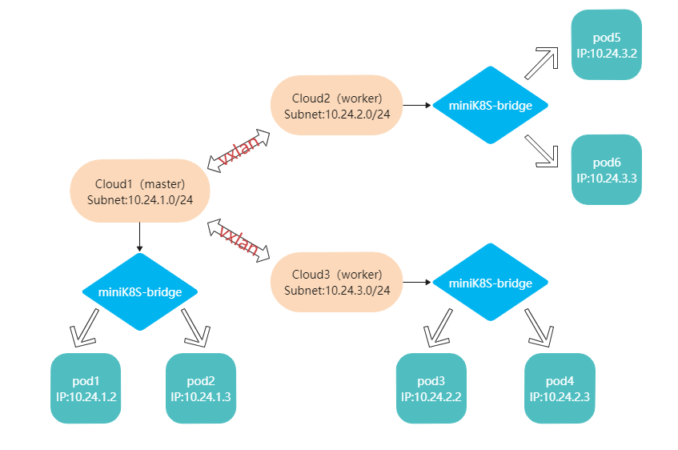
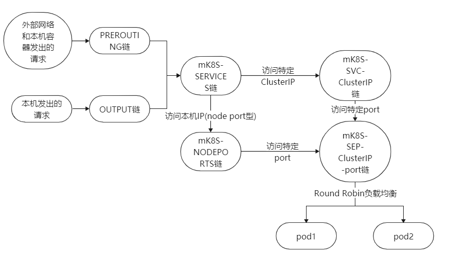
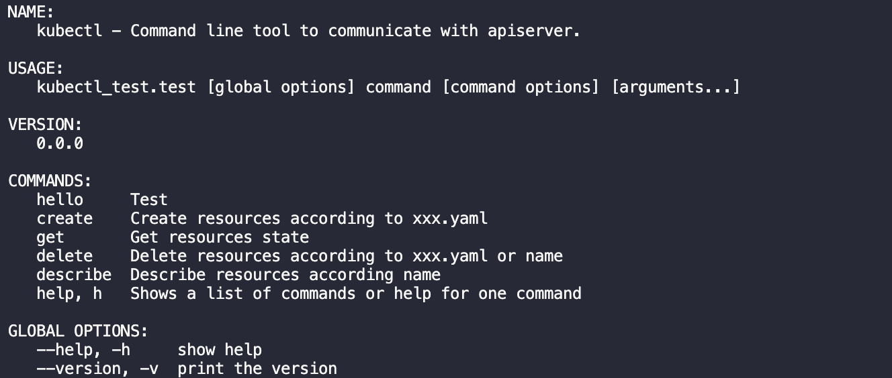

**Mini-kubernetes验收文档**

hjk，tyc，lsh

2022.6

# [目录](#目录)

* [二. 系统架构概述](#系统架构概述)

* [三. 依赖和库](#依赖和库)

* [四. 演示视频](#演示视频)

* [五. 版本管理、开发流程和工程源代码结构](#版本管理开发流程和工程源代码结构)

  * [1. 源代码仓库和分支](#源代码仓库和分支)

  * [2. CICD](#cicd)

  * [3. 软件测试方法](#软件测试方法)

  * [4. 新功能开发流程](#新功能开发流程)

* [六. Etcd及消息广播和传递机制](#etcd及消息广播和传递机制)

* [七. Node的加入、注册和删除](#node的加入注册和删除)

  * [1. Node的加入](#node的加入)

  * [2. Node的heartbeat](#node的heartbeat)

  * [3. Node的删除](#node的删除)

* [八. Pod创建、管理、删除和内部通信](#pod创建管理删除和内部通信)

  * [1. Docker接口的实现](#docker接口的实现)

  * [2. Pod的创建和删除](#pod的创建和删除)

  * [3. Pod的管理](#pod的管理)

  * [4. Pod中localhost通信、volume共享和重点参数实现](#pod中localhost通信volume共享和重点参数实现)

* [九. Kube-proxy、Pod间通信、service和跨集群通信](#kube-proxypod间通信service和跨集群通信)

  * [1. 跨集群使用浮动IP通信的实现](#跨集群使用浮动ip通信的实现)

  * [2. Pod与Pod通信的实现](#pod与pod通信的实现)

  * [3. Service的创建和删除](#service的创建和删除)

  * [4. Kube-proxy、Service通信的实现和负载均衡策略](#kube-proxyservice通信的实现和负载均衡策略)

  * [5. Service在Pod replica创建和删除时的更新](#service在pod-replica创建和删除时的更新)

  * [6. Service与pod匹配机制、selector对多Pod的支持](#service与pod匹配机制selector对多pod的支持)

* [十. Controller、Deployment的管理、AutoScaler的管理和动态扩容策略](#controllerdeployment的管理autoscaler的管理和动态扩容策略)

  * [1. Deployment Controller](#deployment-controller)

  * [2. AutoScaler Controller](#autoscaler-controller)

  * [3. AutoScaler Controller的水平扩容/缩容策略](#autoscaler-controller的水平扩容缩容策略)

* [十一. Scheduler和多机调度策略](#scheduler和多机调度策略)

  * [1. Scheduler的工作流程](#scheduler的工作流程)

  * [2. Scheduler的调度策略](#scheduler的调度策略)

  * [3. Scheduler的初始化](#scheduler的初始化)

* [十二. Gateway和DNS功能实现](#gateway和dns功能实现)

  * [1. 域名解析的实现](#域名解析的实现)

  * [2. Gateway的实现](#gateway的实现)

  * [3. DNS功能的创建、运行和删除](#dns功能的创建运行和删除)

* [十三. Activer和serverless功能实现](#activer和serverless功能实现)

  * [1. 函数的创建和删除](#函数的创建和删除)

  * [2. http trigger、冷启动、负载均衡和动态扩缩容（包括scale-to-0)](#http-trigger冷启动负载均衡和动态扩缩容包括scale-to-0)

  * [3. 函数的更新](#函数的更新)

  * [4. StateMachine(workflow)的定义和实现](#statemachineworkflow的定义和实现)

  * [5. Activer的实现](#activer的实现)

* [十四. GPU功能实现](#gpu功能实现)

* [十五. 容错和控制面重启](#容错和控制面重启)

* [十六. 分工和贡献概览](#分工和贡献概览)

* [十七. 附录一：kubectl交互格式和报错处理](#附录一kubectl交互格式和报错处理)

	* [1. Kubectl 提供的命令接口及其功能](#kubectl-提供的命令接口及其功能)

	* [2. Kubectl的异常处理和报错](#kubectl的异常处理和报错)

* [十八. 附录二：function源代码环境支持和代码规范](#附录二function源代码环境支持和代码规范)

* [十九. 附录三：pipeline流水线CICD脚本](#_Toc105529317)

* [二十. 附录四：ETCD中的存储结构](#_Toc105529318)

# 系统架构概述

Mini-kubernetes主要包括如下组件：

-   **Kubectl**：部署在master节点

负责接收用户指令, 将其解析后发送给ApiServer，并解析ApiServer的response在控制台输出，支持的命令和yaml文件格式仿照kubernetes定义

-   **ApiServer**: 部署在master节点

(1) 提供一系列RESTful接口供kubectl(和其他组件和插件，如Activer)调用, 对指令做具体处理

(2) 提供mini-kubernetes image factory功能, 在基础镜像的基础上自动生成镜像和对应的Pod和Service并部署

-   **Controller**: 部署在master节点

包括三部分，实现为3个goRoutines：

1.  Node Controller: 负责接收kubelet的heartbeat，设置node的状态(Ready/NotReady)

2.  Deployment Controller：负责监控Deployment中replica的数量和运行情况：在Pod replica数量减少/Fail时补充replica

3.  Autoscaler Controller：负责监控AutoScaler中的replica数量、运行情况和资源用量，根据相关指标和用户设置完成动态水平扩容/缩容

-   **Scheduler**：部署在master节点

负责将Pod replica（在mini-kubernetes中常使用PodInstance）调度到节点处，提供多种调度策略，可以在编译时/yaml中指定

-   **CoreDNS**：部署在master节点

负责解析域名，使用开源实现

-   **Activer**：可以部署在任意节点和多实例部署，目前部署在master节点

负责处理serverless function和state machine的http trigger，调用apiServer提供的接口对function做冷启动和动态伸缩

-   **Kubelet**：每个node对应一个kubelet

使用GoRoutines实现如下工作流：

1.  Pod Routine：Watch Etcd，对节点上Pod的增删指令做对应的处理

2.  Heartbeat Routine：定时向node controller发送heartbeat

3.  Pod Check Routine：定时获取当前节点上正常运行的容器（通过Cadvisor client），从而判断容器是否健康运行

4.  Resource Monitor：定时获取当前节点上各容器占用的资源（CPU, Memory, 对IO和网络有预留接口， 通过Cadvisor client）和node节点空闲的物理资源（CPU, Memory）,统计各Pod replica占用的资源，将Pod replica占用的资源和node空闲的资源存储进etcd中

-   **Kube-proxy**：每个node节点各运行一个

提供统一的代理服务，根据映射关系将对service的访问转发到对应的pod上。监听API server中service和endpoint的变化情况，并通过iptables来为service配置负载均衡策略（这里我们采用了round robin的方式）

-   **Cadvisor**：每个node对应一个

用于监控节点上的全部docker container，获取ID列表及每个Container的资源使用（CPU和memory）

-   **Etcd**: 每个运行mini-kubernetes节点（包括master和node）的物理机上各运行一个

充当mini-kubernetes的元数据持久化容器，消息队列，消息广播工具和Watch工具

此外，Mini-kubernetes内置如下几种基础镜像用于自动生成相应的pod和service

-   **Gateway**：内置Spring Cloud Zuul框架和maven、Java环境，用户定义Gateway时由apiServer-image factory填入路由配置信息并编译，重新打包上传得到新的镜像

-   **Serverless_template**：内置Django框架和Python环境，用户定义函数时服务时由spiserver-image factory填入函数内容后拉取依赖，重新打包上传得到新的镜像

-   **GPU Job Uploader**：内置ssh和Python http client，用户定义GPU Job时由spiserver-image factory填入cuda程序，Makefile和Slurm定义后打包得到新的镜像，可以自动上传和提交gpu任务并用轮询的方式判断任务完成情况，在任务完成后下载结果并输出至用户指定的文件目录，并通知apiServer结束Job.

# 依赖和库

Mini-kubernetes使用Go语言开发，在开发预定义基础容器镜像时使用了python，Java和C，在开发过程中使用了如下开源库和开源组件：

-   CoreDNS

-   Cadvisor

-   Etcd

-   Docker client

-   Go后端框架Echo(github.com/labstack/echo)

-   Go定时任务库cron(github.com/robfig/cron)

-   Go命令行开发框架cli(github.com/urfave/cli)

-   Json, yaml解析相关基础库（encording/json，gopkg.in/yaml）

-   网络相关基础库（net/http, github.com/monaco-io/request）

-   系统相关基础库(os，syscall)

-   其他Go提供的基础库(fmt, sync, math, time, strconv, bytes, strings, log, bufio, io)

-   （Java）Spring Cloud Zuul(Gateway基础镜像中提供gateway服务)

-   （Python）Django(functional基础镜像中提供网络服务)

没有使用CNI插件

# 演示视频

Mini-kubernetes实现了文档要求的所有功能。

| 编号 | 视频内容| 视频链接|
|--|--|--|
| 1    | 对应验收文档1和2. 演示多机（1master+3worker）部署minik8s，创建pod，验证localhost、volume，多机调度和删除pod，describe/get pod| [video - OneDrive (sharepoint.com)](https://sjtueducn-my.sharepoint.com/personal/hjk020101_sjtu_edu_cn/_layouts/15/onedrive.aspx?ga=1&id=%2Fpersonal%2Fhjk020101%5Fsjtu%5Fedu%5Fcn%2FDocuments%2F%E4%BA%91%E6%93%8D%E4%BD%9C%E7%B3%BB%E7%BB%9F%E8%AE%BE%E8%AE%A1%E4%B8%8E%E5%AE%9E%E8%B7%B5%2Flab%2FMinik8s%2Fvideo)中的"1.node&pod.mp4"|
| 2    | 对应验收文档3和4. 演示部署deployment，多机分配replica，在deployment的基础上部署service，验证service的多机可访问性，验证service的负载均衡策略，deployment中pod停止工作后自动补充，停止工作的pod被service自动剔除，自动补充的pod被service自动加入，deployment和service的删除和describe/get| [video - OneDrive (sharepoint.com)](https://sjtueducn-my.sharepoint.com/personal/hjk020101_sjtu_edu_cn/_layouts/15/onedrive.aspx?ga=1&id=%2Fpersonal%2Fhjk020101%5Fsjtu%5Fedu%5Fcn%2FDocuments%2F%E4%BA%91%E6%93%8D%E4%BD%9C%E7%B3%BB%E7%BB%9F%E8%AE%BE%E8%AE%A1%E4%B8%8E%E5%AE%9E%E8%B7%B5%2Flab%2FMinik8s%2Fvideo)中的"2.service&deployment.mp4"                       |
| 3&3+ | 对应验收文档5. 演示auto-scaler的部署，通过改变CPU和memory的负载（cpu_boom和memory_boom）演示扩容和缩容，并演示auto-scaler扩容和缩容后建立在其上的service仍可正常多机访问，auto-scaler的删除、describe/get | [video - OneDrive (sharepoint.com)](https://sjtueducn-my.sharepoint.com/personal/hjk020101_sjtu_edu_cn/_layouts/15/onedrive.aspx?ga=1&id=%2Fpersonal%2Fhjk020101%5Fsjtu%5Fedu%5Fcn%2FDocuments%2F%E4%BA%91%E6%93%8D%E4%BD%9C%E7%B3%BB%E7%BB%9F%E8%AE%BE%E8%AE%A1%E4%B8%8E%E5%AE%9E%E8%B7%B5%2Flab%2FMinik8s%2Fvideo) 中的"3.autoscaler_mem.mp4"和"3+.autoscaler_cpu.mp4" |
| 4    | 对应验收文档6. 演示创建DNS，在物理机上通过"域名+路径"访问service，在容器内部通过"域名+路径"访问service，DNS的get/describe和删除| [video - OneDrive (sharepoint.com)](https://sjtueducn-my.sharepoint.com/personal/hjk020101_sjtu_edu_cn/_layouts/15/onedrive.aspx?ga=1&id=%2Fpersonal%2Fhjk020101%5Fsjtu%5Fedu%5Fcn%2FDocuments%2F%E4%BA%91%E6%93%8D%E4%BD%9C%E7%B3%BB%E7%BB%9F%E8%AE%BE%E8%AE%A1%E4%B8%8E%E5%AE%9E%E8%B7%B5%2Flab%2FMinik8s%2Fvideo) 中的"4.dns.mp4"                                     |
| 5    | 对应验收文档7. 演示控制面崩溃后容器仍然正常运行，控制面重启后容器和service仍可正常访问并在kubectl中查看状态| [video - OneDrive (sharepoint.com)](https://sjtueducn-my.sharepoint.com/personal/hjk020101_sjtu_edu_cn/_layouts/15/onedrive.aspx?ga=1&id=%2Fpersonal%2Fhjk020101%5Fsjtu%5Fedu%5Fcn%2FDocuments%2F%E4%BA%91%E6%93%8D%E4%BD%9C%E7%B3%BB%E7%BB%9F%E8%AE%BE%E8%AE%A1%E4%B8%8E%E5%AE%9E%E8%B7%B5%2Flab%2FMinik8s%2Fvideo) 中的"5.control_plane_restart.mp4"                   |
| 6    | 对应验收文档8. 演示提交矩阵乘法和矩阵加法来创建GPU JOB，GPU JOB的get/describe，GPU JOB的自动停止和输出结果，GPU JOB的delete | [video - OneDrive (sharepoint.com)](https://sjtueducn-my.sharepoint.com/personal/hjk020101_sjtu_edu_cn/_layouts/15/onedrive.aspx?ga=1&id=%2Fpersonal%2Fhjk020101%5Fsjtu%5Fedu%5Fcn%2FDocuments%2F%E4%BA%91%E6%93%8D%E4%BD%9C%E7%B3%BB%E7%BB%9F%E8%AE%BE%E8%AE%A1%E4%B8%8E%E5%AE%9E%E8%B7%B5%2Flab%2FMinik8s%2Fvideo) 中的"6.gpu.mp4"                                     |
| 6+   | 对应验收文档8，起佐证作用. 演示GPU JOB在容器内部运行的全过程，包括任务的上传、提交、运行、判断结束、结果下载、删除和发送结果| [video - OneDrive (sharepoint.com)](https://sjtueducn-my.sharepoint.com/personal/hjk020101_sjtu_edu_cn/_layouts/15/onedrive.aspx?ga=1&id=%2Fpersonal%2Fhjk020101%5Fsjtu%5Fedu%5Fcn%2FDocuments%2F%E4%BA%91%E6%93%8D%E4%BD%9C%E7%B3%BB%E7%BB%9F%E8%AE%BE%E8%AE%A1%E4%B8%8E%E5%AE%9E%E8%B7%B5%2Flab%2FMinik8s%2Fvideo) 中的"6+.gpu-in_docker_view.mp4"                     |
| 7    | 对应验收文档Serverless自选功能的1、3、4. 演示function的创建(仿照AWS，minik8s中对应activity类型)、get/describe、冷启动、http trigger（即invoke）、扩容至大于1实例，scale-to-0，更新(update)和删除| [video - OneDrive (sharepoint.com)](https://sjtueducn-my.sharepoint.com/personal/hjk020101_sjtu_edu_cn/_layouts/15/onedrive.aspx?ga=1&id=%2Fpersonal%2Fhjk020101%5Fsjtu%5Fedu%5Fcn%2FDocuments%2F%E4%BA%91%E6%93%8D%E4%BD%9C%E7%B3%BB%E7%BB%9F%E8%AE%BE%E8%AE%A1%E4%B8%8E%E5%AE%9E%E8%B7%B5%2Flab%2FMinik8s%2Fvideo) 中的"7.function.mp4"                                |
| 8    | 对应验收文档Serverless自选功能的2. 演示workflow（仿照AWS，minik8s命名为state machine）的创建，get/describe，http trigger及其在不同输入下的不同workflow（根据条件进入不同分支），以及state machine的删除 | [video - OneDrive (sharepoint.com)](https://sjtueducn-my.sharepoint.com/personal/hjk020101_sjtu_edu_cn/_layouts/15/onedrive.aspx?ga=1&id=%2Fpersonal%2Fhjk020101%5Fsjtu%5Fedu%5Fcn%2FDocuments%2F%E4%BA%91%E6%93%8D%E4%BD%9C%E7%B3%BB%E7%BB%9F%E8%AE%BE%E8%AE%A1%E4%B8%8E%E5%AE%9E%E8%B7%B5%2Flab%2FMinik8s%2Fvideo) 中的"8.statemachine.mp4"                            |

# 版本管理、开发流程和工程源代码结构

## 源代码仓库和分支

本项目使用Git管理，远端仓库地址为 <https://gitee.com/jkhe/mini-kubernetes>

本仓库的Git分支及其作用为：

-   master：项目主线，保存已经完成和通过测试后通过pr合并审查的分支的功能和组件代码；

-   hjk/tyc/lsh：各组员分别对应以名字缩写命名的Git分支，用于保存自己代码修改的提交，在完成一个功能（如一个组件、一个功能或修改一个bug）并进行测试后通过提交pull request，经过审查后并入主线。

## CICD

本项目使用Jenkins进行CICD，在项目的测试服务器上部署了pipeline服务，在Git发生push和pr时进行如下pipeline步骤:

-   更新本地仓库

-   单元测试：运行仓库/test目录下的单元测试

-   编译测试和部署：编译各组件并将可指定文件放置在指定位置

-   启动集群：启动集群中各组件实现部署

相关的pipeline脚本见附录，单元测试、编译、启动集群的具体操作写在仓库根目录下的Makefile中，脚本中通过make+参数调用

CICD运行记录：


## 软件测试方法

在开发过程中，要求每个重点函数在开发完成后进行单元测试，每个功能/组件加入集群后进行系统测试和回归测试

-   单元测试：测试单独的功能点和函数（如解析各yaml定义为go struct的函数，docker exec的函数等），为简化开发流程只测试复杂度高的重点函数，对应的测试代码位于/test目录下，单元测试使用功能测试（黑盒测试）和白盒测试（如分支和条件覆盖）相结合的方法进行

-   系统测试和回归测试：测试集群运行状态下功能（如Pod的创建和删除等功能点）的运行，既测试新加入的功能可以正常运行，又测试之前实现的功能不受影响。测试脚本位于/presentation下，系统测试和回归测试通过运行具体功能的脚本的方式进行，测试用例经过多次迭代和修改其中一部分最终作为答辩演示时使用的测试用例

## 新功能开发流程

-   负责人提出具体功能实现细节和对系统结构的修改，小组讨论后确定实现方式

-   编写代码，编码过程中对复杂度高和功能重要的重点函数进行单元测试，编码过程中可能对实现方式做讨论和修改

-   代码编写完成后进行编译测试、系统测试和回归测试，测试已经完成的功能不受影响，新加入的功能可以正常运行，过程中可能对实现方式做讨论和修改

-   测试完成后提出pr，组长在审查（主要是阅读代码统一编码风格和运行系统测试脚本）通过后并入主线

-   功能或接口比较复杂时，负责人需要编写说明文件供参考（放置在/doc目录下）

# Etcd及消息广播和传递机制

不同于kubernetes使用消息队列进行消息广播和传递，Mini-kubenetes使用Etcd既作为控制面数据持久化容器，又充当消息队列。Etcd运行在集群的各个节点上，除kube-proxy外的全部组件都会连接etcd的client.

Mini-kubenetes集群中各组件把自己的所有重要数据都存进etcd中，这使得几乎所有组件都实现为无状态，方便了控制面重启功能的实现。

消息队列通过Watch Etcd中的某个key的方式实现，例如，要通知kubelet对本Node上的Pod做增删，只需要修改该Node对应的per node pod replica ID list。kubelet会watch该list，如果该list有Pod replica ID增加，kubelet会从etcd中取出该ID对应的pod replica的详细信息并在节点上创建对应的Pod，同理，如果该list有Pod replica ID删除，kubelet会在本node上删除对应的Pod并在etcd中更新该ID对应的Pod replica的状态和信息。这大大减少了集群中消息通知的复杂度，只需要通过在Etcd中维护完整的集群状态记录即可实现对集群状态的更新和控制，kubelet等节点会不断同步Etcd中的集群状态到物理世界（如创建和删除Pod实体），etcd中维护的数据相当于时Mini-kubernetes集群的数字抽象。

Mini-kubenetes通过设计Etcd中各字段的修改者和读取者，保证各字段读写在不加锁的情况下不会出现并发冲突，此外，通过设计字段存储顺序的方式保证了Etcd中数据的一致性和崩溃一致性，如首先持久化一个抽象，再将此抽象的索引（如ID）加入全局list。

Etcd中的存储结构和字段请见附录.

# Node的加入、注册和删除

Worker Node抽象的管理和Worker Node状态的维护由Node Controller负责。

## Node的加入

要启动Mini-kubernetes集群，用户需要手动启动Master Node，之后再各Worker Node上启动kubelet，启动kubelet时用户需要指定Node的name和master节点的注册url，Worker Node加入集群的过程如下

-   Node上的kubelet将自己的name、浮动IP等信息包含在注册请求中发送给Node Controller

-   Node Controller收到注册请求后将这些基本信息记录在etcd当中，之后Node Controller为每个node分配唯一的nodeID和subnet IP区间, 其中nodeID会被加入到etcd中的node ID list中（scheduler watch此条目来获取目前集群中的全部Node），这些数据（nodeID和subnet IP区间）会作为注册请求的response返回给kubelet。

-   Node上的kubelet根据该subnet IP区间创建自己的miniK8S-bridge网桥，我们的miniK8S集群中的网络通信，大部分就是依托于自建的miniK8S-bridge网桥实现的。

## Node的heartbeat

集群中所有的kubelet需要每1min向Node Controller通过http POST的形式发送heartbeat，Node Controller会根据heartbeat更新存储在本地内存中的最近一次收到heartbeat的时间。每隔三分钟Node Controller会检查各Node的最近一次收到heartbeat的时间，如果距今超过3min则将该Node的状态由Ready改为NotReady，**Scheduler不会调度Pod到状态为NotReady的节点上，该节点上所有Pod的状态也将被设为Unknown(表示失联)。**下次检查时如果最近一次收到heartbeat的时间符合条件（距今小于3min），Node Controller会将该Node的状态重新设置为Ready

## Node的删除

用户可通过kubectl向apiserver发送http请求，要求将某一node从集群中移除。Apiserver收到http请求后，将其node ID信息从Node ID List中移除（因此之后不会再有Pod replica调度到该Node上），并在etcd中将存储的该node信息删除。之后，master和该node分别断开与彼此的vxlan隧道连接。

删除Node意味着Node Controller不会再检查Node的状态（Ready/NotReady），Scheduler不会再将Pod replica调度到该Node之上，集群中IP table的修改也不会同步到该Node上，由于各Node与被删除Node的vxlan隧道被断开，该Node和其他Node的跨节点通信也无法进行。但是Mini-kubernetes集群不会删除在该Node上运行的Pod replica，只会在etcd状态中将这些Pod replica的状态设置为FAILED，为避免正在运行的任务受到删除Node的影响，集群管理者应保证删除Node时该Node上没有正在运行的Pod，或删除Node后将受到删除Node影响的任务重新部署。

# Pod创建、管理、删除和内部通信

## Docker接口的实现

我们通过对Docker client库的相关函数和类型进行封装，实现了对容器（包括创建、启动、停止、删除、重启、查看、配置启动命令、将宿主机文件copy进容器等）、镜像（制作、打上tag、上传、拉取等）和容器网络（创建、查看、删除等）的相关操作。

## Pod的创建和删除

不同于传统K8S中的pod，考虑到后续replicas的存在，我们在这里定义了两种结构体：pod和podInstance（也会被称为Pod replica，包含Pod replica的具体信息，如运行的节点和状态）。具体地，前者是yaml文件解析的直接结果，可以看作是后者的元数据；后者相当于传统K8S当中的pod，可以看作是前者的具体实现。每个podInstance只能由一个pod创建而来，而一个pod可以用来创建多个pod-Instance。

**（1）Pod的创建**

-   ApiServer：将kubectl发送来的pod和根据pod新创建得到的podInstance写入到etcd当中，并将该podInstance的ID添加到etcd中的pod replica ID list当中。

-   Scheduler通过Watch Etcd中的pod replica ID list发现有Pod被创建，将其调度到某个Node上运行，具体细节在第九节中详细说明.

-   Kubelet： Node watch在etcd中自己所处node的per node pod replica ID list，发现Pod replica ID增加时使用replica ID从etcd中取出pod replica的详细信息，并在本Node上创建Pod，具体操作为分别创建Pod中包含的各Docker Container并将其ID记录在Etcd中PodInstance的对应位置中

2.  **Pod的删除**

-   Apiserver：先查找是否存在该podInstance，若不存在直接返回404，通知kubectl该podInstance不存在；若存在，从etcd中的pod replica ID list中删除该Pod replica的ID

-   Scheduler：发现etcd中的pod replica ID list中该Pod replica ID被删除后，在该Pod所在Node的per node pod replica ID list中删除该pod replica的ID

-   Kubelet：发现本Node的per node pod replica ID list中该Pod replica的ID被删除后，在本节点删除该Pod对应的各Docker容器，并删除该PodInstance在etcd中对应的数据

## Pod的管理

Kubelet在创建Pod后，会监控器运行状态并更新到Etcd中供controller使用，对容器的监控使用开源组件CAdvisor进行

-   Kubelet每隔30s通过CAdvisor获取当前物理机上正常运行的所有Docker Container的ID，并和该节点上各Pod replica对应的Docker Container的ID对比，如果发现某Pod中的某个Container不在正常运行的Docker Container的ID list中，则将该Pod replica的status改为FAILED并持久化到Etcd中（kubectl可以通过get查看， Deployment Controller会借此判断各replica是否正常运行）

-   Kubelet每隔30s通过CAdvisor获取当前物理机上正常运行的所有Docker Container占用的资源，并和该节点上各Pod replica对应的Docker Container的ID对比，计算出该节点上各Pod replica占用的资源并存储在etcd中（AutoScaler Controller会使用此记录计算各Pod replica平均资源占用并决定是否进行扩容/缩容）

## Pod中localhost通信、volume共享和重点参数实现

1.  localhost通信：每个pod中都会被默认创建一个pause容器，pod内其他容器都通过network=container的网络模式共享该pause容器的网络地址空间。因而同一pod内的所有容器便可以通过localhost实现互相通信

2.  PID、IPC命名空间共享：在/etc/docker/daemon.json里写入\"default-ipc-mode\": \"shareable\"来允许IPC命名空间可被容器共享。然后同样通过（1）中类似的模式指定来指定pause父容器的PID、IPC命名空间被同一pod内其他容器共享

3.  volume共享：我们采用的方式是，在Docker client提供的Mount结构体中，指定容器的mount类型为bind，从而将host机器的目录mount到container中。这样一来，不仅pod内容器可以实现文件共享，容器和物理机之间也可以实现文件共享

4.  资源用量限制：通过配置Docker client提供的Resources结构体参数予以限制

5.  命令与参数：通过配置Docker client提供的Config结构体参数来实现。yaml文件中的spec - containers -- command为容器的启动命令列表，将覆盖容器中的Entrypoint,对应Dockefile中的ENTRYPOINT，我们将其赋给Config中的Entrypoint字段；spec - containers -- args为容器的启动命令参数列表，对应Dockerfile中CMD参数，我们将其赋给Config中的Args字段

6.  容器端口的暴露和映射：通过配置Docker client提供的Config结构体和HostConfig结构体的参数来实现

# Kube-proxy、Pod间通信、service和跨集群通信

## 跨集群使用浮动IP通信的实现

在新的node加入集群后，会尝试使用 open-vswitch 与当前存在于集群中的master node 建立起 miniK8S-bridge 网桥之间的 vxlan 隧道，从而能够访问到其他 node 上的pod。具体地，我们通过open-vswitch新建网桥br0，将miniK8S-bridge和br0连接起来，然后将对应特定IP的vxlan隧道挂在br0上。

当master发现 etcd 中 node 的 ID list 发生变化时（通过watch etcd中的node ID list实现），也会根据其增减状况来尝试搭建和删除与其他 node 之间的 vxlan 隧道。

**Vxlan隧道原理解释**：隧道是一个逻辑上的概念，在 vxlan 模型中并没有具体的物理实体向对应。隧道可以看做是一种虚拟通道，vxlan通信双方认为自己是在直接通信，并不知道底层网络的存在。从整体来说，每个vxlan网络像是为通信的机器搭建了一个单独的通信通道，不同节点上的容器能够通过隧道直连。

如果将vxlan比作"网线"的话，假设hostA连着hostB，hostB连着hostC，那么hostC上的container自然可以通过hostB找到hostA上的container。所以我们在master和其余所有node之间建立起双向的vxlan隧道，就可以实现集群内通过任意浮动IP跨node通信。

对于三台跨子网机器而言，其网络抽象可以用下图表示：



## Pod与Pod通信的实现

（1）相同node内的pod：每个node在向Node Controller注册后会被返回一个不与其他Node重叠的subnet IP 区间，node据此创建自己的miniK8S-bridge网桥，此后创建的所有pod的IP都位于该subnet区间中，各Pod的网络都接入此网桥中。具体地，每个pod中都会被默认创建一个pause容器通过network=bridge的网络模式接入到miniK8S-bridge网桥中，被分配到网桥中的唯一IP，pod内其他容器都通过network=container的网络模式共享该pause容器的网络地址空间。同一node内的所有pod便可以根据pod IP经由miniK8S-bridge网桥自由进行通信。

（2）node的pod通信：由于每个向Node Controller注册的node都会被分配一个不与其他Node重叠的subnet IP 区间，而每个node中创建的pod 所具有的IP也都处于这不相重叠的地址空间内，所以这样就保证了集群内pod IP的唯一性。不同物理机上的pod之间便可以根据彼此的pod IP实现跨node通信。为了实现这一点，我们还需要在路由表里添加规则，使得对其余node的subnet地址空间的访问（即对IP处于该地址空间内pod的访问）都会被转发到本机的miniK8S-bridge网桥上，进而通过vxlan隧道到达目标pod所在node的miniK8S-bridge中，并最终被发送到目标pod的IP上。

## Service的创建和删除

Apiserver收到Kubectl发送的创建Service的请求后，会先尝试在etcd中根据name查找service，若发现同名Service，则直接返回404告知Kubectl不可重复创建。否则进入创建service的流程：

-   ApiServer在etcd中查找符合该Service映射条件的全部pod replica，将其IP和port信息添加到Service的信息当中，再将Service的信息存储到etcd中。

-   Apiserver通过http请求告知所有node上的Kube-proxy更新iptables。

Service的删除流程为通知kube-proxy清除创建时对IPtable的修改并删除etcd中存储的与此相关的信息。

## Kube-proxy、Service通信的实现和负载均衡策略

为了实现Service的功能需求，我们在iptables内新建了mK8S-SERVICES链，负责处理对于Service的访问，并把抵达mK8S-SERVICES链的相应转发规则加入到PREROUTING（处理外部网络和本机容器发出的请求）和OUTPUT（处理本机发出的请求）两条链中。

对于每一个Service，我们都依据它的ClusterIP（集群中唯一）创建一个mK8S-SVC-ClusterIP链，并在mK8S-SERVICES中添加规则，使得所有对该ClusterIP的访问都被转发到这条链上。

接着，对于该Service的每一个port，我们也都创建一个mK8S-SEP-ClusterIP-port链，并在mK8S-SVC-ClusterIP链中添加规则，使得所有对该ClusterIP这一port的访问都被转发到这条链上。在这条链上，我们使用round robin的方式实现负载均衡，将请求转发到所有涉及到的目标pod上。这样，我们就实现了访问ClusterIP类型Service的通信。

NodePort是在ClusterIP的基础上实现的，简而言之就是通过修改iptable的方式将对于物理机port的访问转发到该port对应的NodePort service的ClusterIP上。为了支持NodePort类型的Service，我们还创建了mK8S-NODEPORTS链，并在mK8S-SERVICES链末尾添加规则：只要dst IP是node本机IP的话（--dst-type LOCAL），就跳转到mK8S-NODEPORTS链做进一步判定。在mK8S-NODEPORTS中添加规则，根据yaml中指定的nodeport和service port的对应关系，将对于暴露给外界的特定NodePort的访问都转发到对应的mK8S-SEP-ClusterIP-port链上进行处理。这样，我们就实现了访问nodeport类型Service的通信。

通过IP table处理网络请求的工作流如下图所示：




## Service在Pod replica创建和删除时的更新

当新的pod创建和删除时，ApiServer都会去etcd中找出所有符合该pod映射条件的service，更新其信息并存储在etcd中。

而当集群内的service发生更新（新增、删除、作为endpoint的pod IP发生改变）时，都会由ApiServer同步etcd中的service数据，同时ApiServer还会发送http请求，通知每个node上的kube-proxy 更新本机的iptables。我们的Service（包括ClusterIP和NodePort类型的Service）通信和相关的负载均衡策略均通过修改iptables实现。

通过这种方式，我们保证了Service的转发调度可根据pod的加入删除而动态调整。

## Service与pod匹配机制、selector对多Pod的支持

在确定service中包含的Pod时，我们将pod的metadata.label字段与service的selector.name字段进行比较，若二者相同，即说明该pod符合该service的映射条件，接下来我们再处理它们端口的匹配关系。Service的PortsBinding结构体记录了特定Service端口与特定容器端口的映射关系，以及需要转发到的容器IP List。因而即使Service的一个端口映射到了多个pod内容器的同一端口上，我们同样可以实现转发机制。

我们在Service当中维护了PortsBinding列表，以记录多个不同的端口映射关系。因而，即使具备相同metadata.label的不同pod与Service上的各个端口存在不同的映射关系，我们都能很好地处理。

每次Service建立时都会遍历Pod列表来确定需要被包含在其中的符合条件的Pod replica，每次有新Pod replica创建也会遍历全部Service来确定Pod replica是否需要加入Service，因此service可以支持多个Pod的多个replica，以及不断进行扩容缩容等删减更新操作的Pod replica。

# Controller、Deployment的管理、AutoScaler的管理和动态扩容策略

Controller负责管理集群中的Node、Deployment的AutoScaler，以三个go routine的形式分别实现了Node Controller(已述)、Deployment Controller和AutoScaler Controller。

Controller创建Pod replica和删除Pod replica均调用apiserver创建Pod和删除Pod的接口，此接口在创建Pod replica和删除Pod replica的同时会将Pod replica加入符合条件的service或将其从所处的service中删除。

## Deployment Controller

Deployment Controller主要有如下任务

-   Watch etcd中的all deployment name list，当deployment新增时从取出其详细信息，调用创建Pod replica的接口创建对应数量的Pod replica，当deployment删除时删除其对应的所有Pod replica，并更新Etcd中deployment的状态

-   每隔30s检查一次Deployment的各replica是否正常运行（与kubelet配合），删除状态为FAILED的Pod replica并创建新的Pod replica补充

## AutoScaler Controller

AutoScaler Controller主要有如下任务

-   Watch etcd中的all autoScaler name list，当autoScaler新增时从取出其详细信息，调用创建Pod replica的接口创建最小数量的Pod replica，当autoScaler删除时删除其对应的所有Pod replica，并更新Etcd中autoScaler的状态

-   每隔30s检查一次autoScaler的各replica是否正常运行（与kubelet配合），计算其平均资源用量（资源提供CPU和Memory两种可选项）并判断是否应该扩容/缩容

## AutoScaler Controller的水平扩容/缩容策略

AutoScaler Controller的水平扩容/缩容策略可以概括为如下几点：低于最小平均值的80%缩容，高于最大平均值的120%缩容

-   AutoScaler创建时只创建最小数目的Pod replica作为启动时的初始Pod replica

-   每30s检查一次各replica的运行情况和平均资源用量（与kubelet合作）

-   如果正常运行的Pod replica数目小于最小replica数目，则直接扩容至最小replica数目

-   如果各Pod replica的平均CPU/Memory用量小于最小平均值的80%，则进行缩容，删除集群中占用资源最少的Pod replica（首先，占用资源最少代表删除它影响的正在处理的请求数目最少，删除它对业务影响最小；其次，删除占用资源最少的Pod replica对提高平均资源用量的效果最显著）

-   如果各Pod replica的平均CPU/Memory用量大于最小平均值的120%，则进行扩容，再创建一个Pod replica

之所以每30s检查一次，是因为我们任务一个新的pod至少需要30s才能进入最大吞吐量处理请求的状态，这时对其资源用量进行分析才是有意义的。

之所以扩容和缩容的阈值分别对用户定义的最小资源平均用量和最大资源平均用量向下和向上偏移，是为了防止因为在并发请求数目波动的波峰波谷取样引起Pod replica数目的无意义波动，最大限度维持Pod replica数目的稳定，提高集群中Pod replica的利用率。

# Scheduler和多机调度策略

## Scheduler的工作流程

Scheduler掌管着将Pod replica调度到集群中合适的机器上的工作和向对应kubelet发送删除Pod replica命令的任务，具体工作流程如下：

-   Scheduler通过Watch接口Watch Etcd中的all pod replica ID list，这是整个集群中正在运行的全部Pod replica的ID的集合

-   发现pod replica ID list有Pod replica ID增加时，代表有新的Pod replica需要调度，Scheduler根据调度策略将其调度到某个Node运行，具体调度策略后述，通知kubelet的方法为在该Node对应的per node pod replica ID list中加入该Pod replica的ID（kubelet会watch所在Node对应的per node pod replica ID list，并在其发生变动时同步更新到本地运行的Pod，主要是创建和删除Pod）。如果调度失败则将其加入到fail to schedule pod replica ID list中并持久化到etcd， Scheduler会每30s对该list中的Pod replica重新调度一次，直到存在合适的Node为止。

-   发现pod replica ID list有Pod replica ID被删除时，代表有Pod replica需要被删除，Scheduler通过查看该Pod replica存储在etcd中的数据（其中有其运行在哪个Node）确定其运行的Node并通知该Node将其删除，具体方法为在该Node对应的per node pod replica ID list中删除该Pod replica的ID

## Scheduler的调度策略

Scheduler的调度依据主要有如下几类信息：

-   Pod在定义时用户指定的NodeSelector的With字段（必须和哪个Pod运行在同一Node）和NotWith字段（必须不和哪个Pod运行在同一节点）

-   用户定义的Pod的Container的Resource的Request字段，将该Pod中全部Container的该字段加和可以得到Pod运行所需的最小资源（主要是CPU和内存）

-   各物理节点的现存资源和使用情况，主要是物理节点的CPU空闲率、CPU核数、空闲内大小和现在运行的Pod数目

Scheduler的调度流程为

-   以全部Node的集合为起始

-   经过With Filter和NotWith Filter以及ReSource Filter筛选出符合Pod的With和NottWith要求以及最小空闲资源要求的节点

-   如果此时Node集合为空，则调度失败

-   如果Node集合非空，则选择最合适节点

选择最合适节点的依据有如下两种，可以在编译时确定

（1） 选择空闲硬件资源最丰富的节点：即选择

$$空闲内存大小\left. （MB \right.） + 1000 \times (1 - CPU平均占用率) \times CPU核数$$

最大的节点

（2） 选择现运行Pod数目最少的节点

在生产环境下，使用（1）号策略更有利于为Pod运行提供充足的资源，但在答辩验收环境下由于和Master节点运行在同一物理机上的Worker Node硬件资源显著少于其他Worker Node，为避免该Node无Pod运行，答辩演示时使用了（2）号选择策略。

## Scheduler的初始化

合适的初始化流程是控制面重启的关键，Scheduler需要在启动时需要初始化本地元数据，主要有如下几项

-   已经完成调度的Pod replica ID list，只有和已经完成调度的Pod replica ID list对比才能知道需要调度和删除哪个Pod replica，已经完成调度的Pod replica ID list通过从etcd中查询各Node的per node pod replica ID list并取并集来初始化，该List之后会在每次完成Pod replica调度或删除后更新

-   现有全部Node及各Node上的正在运行的Pod replica ID，前者通过读取etcd中的node ID list来初始化，并会通过watch此node ID list实时同步，后者通过查询各Node的per node pod replica ID list来实现，并会在调度和删除过程中实时同步

此外，Scheduler中还缓存了各Pod replica的概要信息来方便调度时减少etcd查询次数，主要是各Pod replica对应的Pod Name和Pod Label，也会在启动时初始化并实时同步。

# Gateway和DNS功能实现

## 域名解析的实现

DNS利用开源的CoreDNS组件实现域名解析，CoreDNS启动后监听在Master节点的53端口。ApiServer根据yaml文件的配置，将特定的域名经处理后作为key，生成的Gateway pod的IP地址作为value，存入etcd中。此后对于该域名的所有访问都将经由coredns转发到Gateway pod中进行处理。

为了使集群的DNS服务器为CoreDNS，需要对云主机的配置修改：

-   在master的/etc/resolv.conf中第一行写入nameserver 127.0.0.1，在其余node的/etc/resolv.conf中第一行写入nameserver + master的浮动IP，从而指定DNS解析的服务器。

-   在每台云主机的/etc/hosts中第一行的127.0.0.1 localhost 后写上本台云主机的名称，这是为了避免出现"unable to resolve host cloud1: Temporary failure in name resolution"类似的报错

## Gateway的实现

在DNS服务里，Gateway的作用为根据用户的定义，将不同路径的请求分别转发到对应的service的ClusterIP。

在Mini-kubernetes中Gateway以Pod的形式运行在集群中， DNS会将域名解析为对应的Gateway Pod的Pod IP，Gateway Pod会将请求分别重定向到对应的service的ClusterIP。

创建Gateway Pod的流程如下：

-   ApiServer根据yaml中path和serviceName的对应关系，结合Etcd中存储的Service和ClusterIP的对应关系，确定请求的path和ClusterIP的对应关系，并据此生成定义重定向关系的yaml文件（由于Gateway镜像的基础镜像使用的框架为Spring Cloud Zuul，该yaml文件格式与Zuul的配置文件格式匹配）。

-   ApiServer中的Image Factory拉取基础镜像zuul，并运行；之后使用docker copy接口将上一步确定的yaml配置文件写入预定路径，并调用docker exec接口完成对Maven工程（Zuul）的编译和打包，此时Container内已经有了可以正常运行的Gateway应用

-   ApiServer使用docker commit和docker push接口提交该Container为新的Docker Image

-   Apiserver生成运行该Docker Image的Pod，并复用ApiServer创建Pod的接口在集群中部署运行此Gateway Pod。

## DNS功能的创建、运行和删除

-   **创建：**Apiserver在获取到kubectl发送来的DNS信息后，从etcd中查找出相应的Service并补充在DNS的路径解析信息当中，然后将完善后的DNS信息存储在etcd中，接着创建Gateway pod

-   **运行：**当master上的pod或用户进行域名访问时，由于配置本机为域名服务器，运行在53端口监听TCP请求的CoreDNS会直接进行处理；当其他node上的pod或用户进行域名访问时，会根据/etc/resolv.conf里的配置将master作为域名服务器。node向master发送域名解析请求，然后由master上的CoreDNS处理。CoreDNS将经处理后的域名作为key，从etcd中查找出对应Gateway pod的IP地址。之后请求将发往Gateway pod，Gateway pod会根据配置文件里的配置将访问请求转发到特定的Service里。

# Activer和serverless功能实现

## 函数的创建和删除

用户定义函数时需要提供函数的源代码文件路径（源代码格式规范和代码环境支持见附录，用户在源代码中可以使用环境提供的预先解析的请求体和请求url中附带的参数），依赖文件路径（对于Python而言主要是Requirments.txt），以及函数的版本（为update准备）

ApiSever收到用户提交的函数定义文件后：

(1) 首先制作函数镜像，ApiServer运行预先准备好的python_serverless_tmplate镜像，使用包装了docker copy的go接口将python源代码和依赖文件写入预定义的位置，之后使用包装了docker exec的go接口运行pip命令在容器中拉取依赖，依赖拉取结束后，ApiServer使用包装了docker commit和docker push的go接口提交该容器制作新的镜像（该镜像名字为function名字+版本号+UUID），之后停止和移除该容器（有关docker接口的封装请见前文）

(2) 之后，ApiServer自动生成运行该镜像的Pod定义文件并将其存储在etcd中，并自动生成可以访问到该类Pod 80端口的ClusterIP型service的定义，并在集群中运行该service(由于此时集群中没有service对应的Pod replica，该service目前无法提供正常访问，只是形式上部署)，之后，ApiServer将function实例的详细信息记录在etcd中，并将function的name记录在etcd的function name list中（此时watch该list的Activer收到function创建的消息，并在内存中创建用于记录function并发访问数目的map），此时function的create完成

(3) ApiServer创建用于http trigger的url，其ip和端口为function分配到的Activer的IP和端口，具体为：activerIP:activerPort/function/\`functionName\`，Activer在物理机浮动IP的端口运行，集群外也可以使用该url发起http trigger，http trigger的发起方式与发送普通http请求没有区别，开发人员使用curl或PostMan等http发送工具测试。Kubectl会将这个url输出给用户。

Function的删除使用需要ApiServer删除集群中正在运行的全部Pod Replica，并在Etcd的function name list中删除function的Name(Watch该list的Activer会删除内存中用于记录的并发访问数的map条目)，之后删除function对应的Service、function和对应Pod的定义文件。删除Pod replica和Service复用了Pod和Service的删除接口。

## http trigger、冷启动、负载均衡和动态扩缩容（包括scale-to-0）

Activer处理http trigger的流程为：

-   记录function访问（用于根据并发访问数动态伸缩）

-   查看集群中有无Pod replica运行，如果没有，启动冷启动流程

-   向function对应的service的ClusterIP发送转发http trigger的http 请求，并将结果返回给用户

Function在创建时并没有Pod replica在集群中运行，此时function的自动生成的Docker Image和Pod定义文件已经存储在etcd中，当http trigger到来时，Activer接收到该http trigger并查找集群中运行的Replica数目，如果replica数目为0则function开始冷启动，Activer复用Apiserver创建Pod的接口，使用预定义的Pod定义文件，要求ApiServer创建一个运行function定义的服务的Pod，如上所述，这个Pod会自动加入service中。

Activer会记录并发访问的次数，以此为依据进行动态扩容和缩容，动态扩容的缩容的策略为：**快速扩容、缓慢缩容**。Activer每30s对各function进行一次动态实例数目调整，调整的目标为前30s内对应function收到的http trigger数目除以预定义的值后向上取整（在演示环境下，为方便演示扩容至\>2实例，这个值为5，生产环境下可以调整至更大），如果现有实例数目大于目标值则进行慢速缩容，不管目标值为多少，每次缩容仅删除一个Pod实例，删除Pod实例复用ApiServer的Pod删除接口；如果实例数目小于目标值，则进行快速扩容，直接扩容至目标值。通过快速扩容和慢速缩容，集群可以以最快速度满足客户端要求，并最大限度利用已经创建的实例，防止因为并发请求数波动引起集群内Pod replica数目不断波动带来的开销，使集群内Pod replica的数目在波动的并发请求数下仍然保持相对稳定。新创建的和删除的Pod都会同步加入对应的service或从service中删除。

在负载均衡方面，Activer并不直接负责Pod replica之间的负载均衡，function只访问对应service的ClusterIP，由service做不同Pod之间的负载均衡，这复用了service已经实现的基础功能，降低了集群复杂度。

由动态扩缩容策略可知，若一段时间内某function没有http trigger，其对应的Pod replica将以每30s减少一个的速度逐步减少到0，实现scale-to-0。

## 函数的更新

Mini-kubernetes为用户提供了两种function update接口：

-   Soft-Update：ApiServer使用新版function定义重新创建Docker Image和Pod定义文件来替换原有的，之后扩容时创建的Pod replica均为新版function，但已经运行在集群中的Pod replica不会删除，通过function的扩缩容将其逐步淘汰。Soft-Update在更新函数过程中不会停止函数服务，适合接口向后兼容的函数的更新。

-   Hard-Update：ApiServer会使用新版function定义重新创建Docker Image和Pod定义文件来替换原有的，并删除集群中运行的旧版function实例，之后新版function重新进行冷启动流程。Hard-Update相当于Delete+Create，它一次性停止集群内全部旧版function的更新，但代价是函数服务会停止运行一段时间，适合因为漏洞和缺陷需要应急更新函数和接口不向后兼容的函数的更新。

## StateMachine(workflow)的定义和实现

StateMachine仿照AWS StateMachine的定义格式，每个function和分支判断都被定义为一个State，workflow在State中不断传递，如果State时function(对应Task)则以上个State返回response body作为输入对该function发起http trigger（复用了function的http trigger接口），如果State是分支判断则使用上个State的response body进行判断并以该response body作为本State的输出，状态机以用户定义的\`StartAt\`状态开始，向各State的\`NextState\`传递（Task有一个，Choice的每个分支各对应一个），在定义为\`EndState\`的State结束并将response body返回给用户。与形式化理论中的状态机工作过程类似。

StateMachine同样使用绑定在物理机浮动IP和Port上的url进行http trigger，url为activerIP:activerPort/stateMachine/\`stateMachineName\`。

创建StateMachine的流程十分简单，ApiServer只检查StateMachine中是否存在起始和终止状态、各属性为Task的State是否已经创建对应的function，之后将StateMachine的定义文件存储在etcd中即可，在http trigger发生后，Activer会根据StateMachine的Name取出StateMachine的详细信息并以此为地图处理http trigger。

StateMachine的删除同样也只需要删除etcd中存储的StateMachine定义即可。

## Activer的实现

Activer由以下三个线程组成：

-   function name list Watcher：负责watch function name list，在其发生变动（增加和删除function）时同步更新（增加和删除）内存中记录用于记录并发访问数的map的条目。

-   主服务线程：运行在Activer对应的物理端口上，接收和处理function的stateMachine的http trigger，为提高并发性，每个http trigger的处理都创建新的线程来处理后返回。

-   扩缩容线程：每30s唤醒一次，执行function对于的Pod Replica的动态扩容缩容，扩容缩容策略已述。

# GPU功能实现

Mini-kubernetes实现GPU任务上传和运行功能的方式为Job，创建一个GPU JOB的流程如下：

-   用户通过Kubectl发送create命令并提供GPU JOB定义文件，文件中包括GPU JOB的名字，.cu源代码的位置，Makefile的位置，slurm相关的参数（如需要CPU和GPU的数目、提交到的集群的名称）以及输出结果的目录（为了避免Kubectl由于执行GPU JOB长时间阻塞，ApiServer在创建对应的Pod后立刻返回，用户可以使用GPU JOB的get接口查询GPU JOB的运行情况，如是否完成和是否出错，任务完成后，ApiServer会在用户定义的输出结果目录下创建result.out和error.err文件分别记录GPU JOB运行的结果和报错）

-   ApiService的Image Factory根据定义文件生成该任务对应的Docker Image，具体流程为：

    1.  拉取和运行Docker基础镜像：gpu_job_uploader

    2.  根据yaml定义生成slurm文件，将其使用docker copy接口写入docker容器中的预定位置，读取用户指定的源代码(.cu)文件和Makefile文件，使用docker copy接口写入到docker容器中的预定位置，将yaml的任务的名字、master用于接收GPU JOB运行结束和运行结果的http请求的url写入docker容器的预定义位置

    3.  使用docker commit和docker push上传修改后的容器，新镜像命名为GPU JOB的name+UUID，之后停止和移除该docker容器

-   ApiServer将GPU JOB的定义数据和状态（尚未运行和拉取镜像阶段为PENDING，正在运行阶段为RUNNING，运行成功并结束状态为SUCCESS，运行失败状态为FAILED，由于网络故障失联状态为UNKNOWN）存进etcd中。

-   在创建好GPU JOB对应的Docker Image后， Apiserver生成可以运行该docker容器的Pod定义文件，并复用Pod的create接口在集群中运行之。

之后进入容器运行阶段，使用容器基础镜像内预置的sh脚本进行，具体流程如下：

-   容器使用scp指令将容器中的.cu源代码文件、Makefile文件、slurm文件上传到slurm对应集群的任务上传节点，为了便于多个GPU任务同时执行，不同任务的目录名不同，目录名具体为：GPU JOB的名字+UUID(GPU JOB的名字在制作镜像时已经写在容器中的预定位置)，这保证了集群中GPU JOB可以并行上传和运行

-   上传结束后，容器使用SSH命令（容器内置了SSH无密码登录的环境）运行sbatch命令向slurm调度系统提交GPU任务

-   之后容器通过轮询的方式判断GPU任务是否执行结束，容器每5s通过SSH向该GPU任务对应的目录发送ls命令获取结果，如果ls命令获取的结果中包含result.out和error.err文件代表任务已经执行完毕（这两个文件记录了GPU任务执行的输出和报错，任务上传时目录下不包含这两个文件，slurm只在任务结束后将结果写入该文件），多次测试发现这样判断任务是否结束最为准确，使用squeue或sacct等命令获取的数据有可能因为不同步而造成误判。

-   发现命令结束完毕后使用scp命令将结果文件(result.out和error.err)下载到docker容器中

-   使用http请求向Master接收GPU JOB完成信号的url(url在制作镜像时已经写在容器中的预定位置)，该信号为http POST请求，其中包含了result.out和error.err中读取的内容

此时Pod的任务已经完成，接下来ApiServer收到任务完成信号后执行后续工作:

-   Apiserver将结果和报错分别输出到用户定义的结果输出目录的result.out和error.err文件中，并将GPU JOB的状态标记为SUCCESS，此时用户可以查看GPU JOB的运行结果

-   ApiServer之后复用Pod的删除接口删除执行GPU JOB任务的Pod

GPU JOB的删除流程为若GPU JOB对应的Pod没有运行结束被自动删除则先删除该Pod，之后删除etcd中GPU JOB对应的数据.

GPU JOB的实现通过不同GPU JOB单独在一个Pod中运行和不同GPU JOB上传到服务器的不同目录下实现了GPU JOB的并行运行，通过Pod主动向ApiServer发送任务完成信号实现了Job的主动停止和结果的传递。

# 容错和控制面重启

为方便控制面重启，Mini-Kubernetes中的每个组件都实现为无状态，具体而言：

对于controller、scheduler、ApiServer而言，其作用为根据etcd中一些持久化数据的变化（Controller、Scheduler）或http指令（ApiServer）对其他数据做修改，即传递和同步etcd中存储的状态的变化。如Deployment Controller通过监视etcd中Deployment的各Pod replica的运行状态，根据运行状态决定删除故障replica（在etcd中的all Pod replica list中删除该replica的ID）和添加新的replica（创建Pod replica将其信息存储进etcd，并在all Pod replica list中加入该replica的ID）；Scheduler通过监视all Pod replica list的变化将Pod replica调度到对应node（在etcd中该node对应的per node pod replica ID list中加入该pod replica的ID）或删除all Pod replica list中删除的Pod replica（在etcd中从node对应的per node pod replica ID list中删除该pod replica的ID）。这类组件只要做好启动时的初始化工作（初始化的目的为确定已经完成的任务，相当于建立组件的本地缓存，从而得到尚待完成的任务，如scheduler初始化时需要查询各node上已经调度的Pod replica从而获得已经完成调度的pod replica ID list），和运行中对集群状态改写的持久化工作（及时存储进etcd）即可实现控制面重启。

对于Kubelet等组件而言，其作用为将etcd中的状态更新同步到物理机的应用层（如创建和删除Pod），其启动时需要做的初始化工作为确定已经完成的同步工作，如对于kubelet而言，通过读取etcd中的信息（具体为所在node的per node pod replica ID list和list中各Pod replica的运行状态）可以得到所在集群中现有的Pod及其运行情况，使用初始化后的Pod replica ID list和etcd中对应的per node pod replica ID list对比可以得知需要创建和删除的Pod replica有哪些。

对于Kubectl、kube-proxy等组件而言，其作用为流式处理发送对应监听端口/shell的请求，如Kubectl解析shell命令并调用ApiServer接口，kube-proxy根据ApiServer的http命令改写本地shell接口，这些组件可以不初始化即可运行。

总之，控制面重启通过及时持久化对集群状态的更新和在组件启动时初始化以探测集群状态来实现。

# 分工和贡献概览

具体分工请见各次迭代计划


|组员|分工|贡献度/%|
|--|--|--|
|hjk|略|0|
|tyc|略|0|
|lsh|略|0|

# 附录一：kubectl交互格式和报错处理

## Kubectl 提供的命令接口及其功能

1.1 Pod

-   kubectl create -f xxx.yaml

> 根据配置文件创建pod资源，xxx.yaml为yaml文件位置。

-   kubectl describe pod xxx.yaml/yyy

  查看pod信息，可以通过pod的名称或pod配置文件来确定pod。

-   kubectl get pods

  查看所有pod的简要信息，具体格式如下：


-   kubectl delete pod yyy

  根据pod名称删除对应pod。

1.2 Service（包括ClusterIP和Nodeport两种类型）

-   kubectl create -f xxx.yaml

根据配置文件创建service资源，xxx.yaml为yaml文件位置。

-   kubectl describe service xxx.yaml/yyy

查看service信息，可以通过service的名称或service配置文件来确定service。

-   kubectl get services

查看所有service的简要信息，具体格式如下：


-   kubectl delete service yyy

  根据service名称删除对应service。

1.3 DNS

-   kubectl create -f xxx.yaml

根据配置文件创建dns资源，xxx.yaml为yaml文件位置。

-   kubectl describe dns xxx.yaml/yyy

查看dns信息，可以通过dns的名称或dns配置文件来确定dns。

-   kubectl delete dns xxx.yaml/yyy

删除某DNS任务

-   kubectl get dns

  查看所有dns的简要信息，具体格式如下：


1.4 Deployment

-   kubectl create -f xxx.yaml

根据配置文件创建deployment资源，xxx.yaml为yaml文件位置。

-   kubectl describe deployment xxx.yaml/yyy

查看deployment信息，可以通过名称或配置文件来确定deployment。

-   kubectl get deployment

> 查看所有deployment的简要信息，具体格式如下：


-   kubectl delete deployment yyy

  根据deployment名称删除对应deployment。

1.5 Autoscaler

-   kubectl create -f xxx.yaml

根据配置文件创建autoscaler资源，xxx.yaml为yaml文件位置。

-   kubectl describe autoscaler xxx.yaml/yyy

查看autoscaler信息，可以通过名称或配置文件来确定autoscaler。

-   kubectl get autoscaler

> 查看所有autoscaler的简要信息，具体格式如下：


-   kubectl delete autoscaler yyy

  根据autoscaler名称删除对应autoscaler。

1.6 GPUJob

-   kubectl create -f xxx.yaml

根据配置文件创建gpujob资源，xxx.yaml为yaml文件位置。

-   kubectl describe gpujob xxx.yaml/yyy

查看gpujob信息，可以通过名称或配置文件来确定gpujob。

-   kubectl get gpujob

查看所有gpujob的简要信息，字段包括：

> NAME POD-NODE POD-STATUS POD-ID POD-STIME

1.7 Function

-   kubectl create -f xxx.yaml

根据配置文件创建function资源，xxx.yaml为yaml文件位置。

-   kubectl describe function xxx.yaml/yyy

查看function信息，可以通过名称或配置文件来确定function。

-   kubectl get function

查看所有function的简要信息，字段包括：

NAME VERSION URL

-   kubectl update soft -f xxx.yaml

  根据function配置文件软更新function。

-   kubectl update hard -f xxx.yaml

  根据function配置文件硬更新function。

-   kubectl delete function yyy

  根据function名称删除对应function。

1.8 Statemachine

-   kubectl create -f xxx.yaml

根据配置文件创建statemachine资源，xxx.yaml为yaml文件位置。

-   kubectl describe statemachine yyy

查看statemachine信息，可以通过名称来确定statemachine。

-   kubectl get statemachine

查看所有statemachine的简要信息，字段包括：

NAME STARTAT URL

-   kubectl delete statemachine yyy

  根据statemachine名称删除对应statemachine。

1.9 node

-   kubectl get node

查看所有node的简要信息，字段包括：

NAME IP STATUS ID

-   kubectl delete node yyy

  根据node名称删除对应node。

1.10 其它

-   kubectl

> 显示所有可用的kubectl命令。



## Kubectl的异常处理和报错

2.1 未找到文件或地址


2.2 命令行参数错误或缺失


2.3 yaml文件格式错误


2.4 API server返回值为空

例如输入 kubectl get pods，而API server返回值为空，输出\"No pod exists\"。

2.5 API server返回状态错误

直接输出API server返回的错误信息

# 附录二：function源代码环境支持和代码规范

1.  function源代码中应该有一个定义为handler(env)的函数，Mini-Kubelet通过调用该函数处理请求完成函数服务

2.  handler函数的env为函数运行的参数环境，具体而言：

-   env.url为请求url的解析结果，可以使用env.url.get('参数名'，默认值)的方法获取请求url中的参数

-   env.body为请求体的解析结果可以使用env.body\['字段名'\]的方法获取请求体中的字段

3.  对于handler中返回的结果，基础执行环境会将其转为json格式作为响应返回。

# 附录三：pipeline流水线CICD脚本
````
pipeline {
	agent any
	stages {
		stage(\'Checkout\') {
			steps {
				dir(\"/home/cicd/mini-kubernetes\"){
					git credentialsId: \'\*\', url:\'https://gitee.com/jkhe/mini-kubernetes.git\'
				}
			}
		}
		stage(\'Build\') {
			steps {
				dir(\"/home/cicd/mini-kubernetes/\"){
					sh \'make master\'
					sh \'make node\'
				}
			}
		}
		stage(\'Deploy\') {
			steps {
				dir(\"/home/cicd/mini-kubernetes/\"){
					sh \'make run_master\'
					sh \'make run_node\'
				}
			}
		}
		stage(\'Test\') {
			steps {
				dir(\"/home/cicd/mini-kubernetes/\"){
					sh \'make test\'
				}
			}
		}
	}
}
````
# 附录四：ETCD中的存储结构
````
.etcd_____//meta data:
		|____{pod meta}(per pod)
		|____{pod instance meta}(per pod replica)
		|____{service meta}(per service)
		|____{function meta}(per function)
		|____{stateMachine meta}(per stateMachine)
		|____{deployment meta}(per deployment)
		|____{autoscaler meta}(per autoscaler)
		|____{gpuJob meta}(per gpuJob)
		|____{node meta}(per node)
		|____{dns meta}(per dns)
		|____{node resource record}
		| (per node, record node\'s available CPU & memory)
		|____{podInstance resource record}
		| (per pod, record node\'s CPU & memory usage)
		| // list:
		|____node ID list(all node\'s ID)
		|____{pod repilca ID list}
		| (per pod, record the pod\'s replicas\' ID)
		|____function name list(all function\'s name)
		|____deployment name list(all deployment\'s name)
		|____horizontal pod autoscaler name list(all autoscaler\'s name)
		|____{node pod replica ID list}
		| (per node, record the ID of pod replicas running on the node)
		|____pod replica ID list(all pod replica\'s ID)
````
